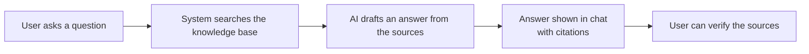

# Nexus AI

> **Banner placeholder** — add a project logo/visual here (e.g. ``).

**Enterprise AI Knowledge & Agent Platform** — helps organizations search, manage, and understand their own documents and data using artificial intelligence, then answer questions with verifiable sources.

---

📌 **TL;DR for Recruiters**

- **A full-stack AI platform built from the ground up** — not a tutorial app. It designs, builds, and ships a real product covering frontend, API, AI logic, and infrastructure.
- **Covers the entire stack** — modern web UI (Next.js), API gateway (NestJS), Python AI services (FastAPI + LangChain), and deployment (Docker).
- **Production-minded** — secure login & role-based access (JWT/RBAC/ACL), security hardening, automated testing, and observability.
- **Modular microservices architecture** — clean separation of frontend, gateway, AI backend, background workers, and infrastructure.

---

## ✨ What Nexus AI Does

<details>
<summary><b>🤖 AI Knowledge Base (RAG)</b></summary>

**What it is:** Lets users upload documents (PDF, Markdown, TXT, HTML) and instantly "ask questions" about them.

**Why it matters:** Instead of reading hundreds of pages, an employee types a question and gets a precise answer with *citations* showing exactly where the information came from. No guessing, no hallucination — every answer is sourced.

</details>

<details>
<summary><b>💬 AI Help Desk</b></summary>

**What it is:** A smart assistant that understands an organization's internal knowledge and handles support questions.

**Why it matters:** Reduces repetitive manual work. Customers/employees get fast, accurate answers 24/7, while the assistant escalates to a human when needed.

</details>

<details>
<summary><b>🧠 AI Decision Manager & Agents</b></summary>

**What it is:** Autonomous AI agents that run multi-step tasks — planning, gathering information, and acting — governed by clear rules.

**Why it matters:** Goes beyond simple chat. The platform can guide complex business decisions by chaining reasoning steps, with full audit logs of what the AI did and why.

</details>

<details>
<summary><b>🔌 Enterprise Integration (MCP)</b></summary>

**What it is:** Standardized connectors that let the AI reach the company's real tools and systems (CRMs, databases, ticketing, etc.).

**Why it matters:** The AI doesn't live in a vacuum — it can safely read and act on real business data through one secure, governed interface.

</details>

---

## 🧭 How It Works (Plain English)

<details>
<summary><b>One question, fully-sourced answer — in 4 steps:</b></summary>



1. **Ask** — a user types a question in plain language.
2. **Search** — the system finds the most relevant documents using both semantic (meaning) and keyword matching.
3. **Draft** — the AI writes a concise answer using *only* the retrieved sources — nothing invented.
4. **Verify** — every answer includes source citations, so facts can always be double-checked.

</details>

---

## 🎬 Visuals

> Placeholders — add real assets as they become available.

- **Live demo:** `[▶ Live Demo](https://your-demo-url)` *(add link when deployed)*
- **Demo GIF:** `` *(add file when ready)*
- **Screenshots:** `` *(add file when ready)*

---

## 🛠 Technology

| Area                | Tools                                       |
|---------------------|---------------------------------------------|
| Frontend            | Next.js, TypeScript, Tailwind, shadcn/ui   |
| API Gateway         | NestJS, TypeScript, Socket.IO               |
| AI Backend          | Python, FastAPI, LangChain, LangGraph       |
| Data & Search       | PostgreSQL + pgvector (semantic search)     |
| Background Jobs     | Celery + Redis                              |
| Infrastructure      | Docker Compose, MCP Client/Server           |

**Why these choices?** Every tool is an industry standard and widely used in production — meaning the codebase is maintainable and the pattern is directly transferable to real-world teams.

---

## 📂 Repo Walkthrough

<details>
<summary><b>Where everything lives (click to expand)</b></summary>

```
nexus-ai/
├── frontend/      # Web application users see and interact with
├── gateway/       # API gateway — handles login, security, and routing
├── ai-backend/    # Python AI services — search, chat, and reasoning
├── docs/          # Full technical specifications (18 documents)
├── ai/            # AI system prompts & guardrails
├── infrastructure/# Docker & deployment configuration
├── tasks/         # Step-by-step implementation roadmap
├── prompts/       # Development guides for each layer
└── scripts/       # Utility & setup scripts
```

</details>

---

## 🔗 More

<details>
<summary><b>Technical documentation</b></summary>

- **Product spec** — `docs/01-PRD.md`
- **Architecture** — `docs/03-SYSTEM-ARCHITECTURE.md`
- **Database design** — `docs/04-DATABASE-DESIGN.md`
- **API specification** — `docs/05-API-SPECIFICATION.md`
- **Security** — `docs/16-SECURITY.md`
- **Testing strategy** — `docs/17-TESTING-STRATEGY.md`
- ...and 12 more specification documents in `docs/`.

</details>

---

## License

Proprietary. All rights reserved.