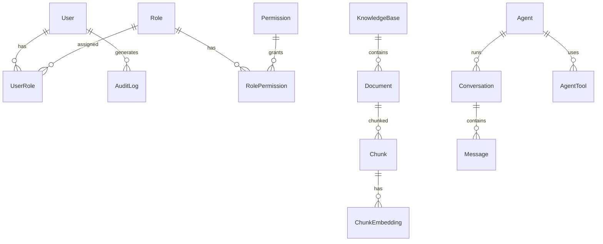

# 04 — Database Design

## Entity-Relationship Overview

### Core Schema



## Tables

### Users & Auth

```sql
CREATE TABLE users (
    id UUID PRIMARY KEY DEFAULT gen_random_uuid(),
    email VARCHAR(255) UNIQUE NOT NULL,
    password_hash VARCHAR(255) NOT NULL,
    display_name VARCHAR(100) NOT NULL,
    is_active BOOLEAN DEFAULT true,
    created_at TIMESTAMPTZ DEFAULT NOW(),
    updated_at TIMESTAMPTZ DEFAULT NOW()
);

CREATE TABLE roles (
    id UUID PRIMARY KEY DEFAULT gen_random_uuid(),
    name VARCHAR(50) UNIQUE NOT NULL,
    description TEXT,
    created_at TIMESTAMPTZ DEFAULT NOW()
);

CREATE TABLE permissions (
    id UUID PRIMARY KEY DEFAULT gen_random_uuid(),
    resource VARCHAR(100) NOT NULL,
    action VARCHAR(50) NOT NULL,
    UNIQUE(resource, action)
);

CREATE TABLE user_roles (
    user_id UUID REFERENCES users(id) ON DELETE CASCADE,
    role_id UUID REFERENCES roles(id) ON DELETE CASCADE,
    PRIMARY KEY (user_id, role_id)
);

CREATE TABLE role_permissions (
    role_id UUID REFERENCES roles(id) ON DELETE CASCADE,
    permission_id UUID REFERENCES permissions(id) ON DELETE CASCADE,
    PRIMARY KEY (role_id, permission_id)
);

CREATE TABLE refresh_tokens (
    id UUID PRIMARY KEY DEFAULT gen_random_uuid(),
    user_id UUID REFERENCES users(id) ON DELETE CASCADE,
    token_hash VARCHAR(255) NOT NULL,
    expires_at TIMESTAMPTZ NOT NULL,
    revoked BOOLEAN DEFAULT false,
    created_at TIMESTAMPTZ DEFAULT NOW()
);
```

### Knowledge Base

```sql
CREATE TABLE knowledge_bases (
    id UUID PRIMARY KEY DEFAULT gen_random_uuid(),
    name VARCHAR(255) NOT NULL,
    description TEXT,
    owner_id UUID REFERENCES users(id),
    embedding_model VARCHAR(100) DEFAULT 'text-embedding-3-small',
    chunk_size INT DEFAULT 1000,
    chunk_overlap INT DEFAULT 200,
    created_at TIMESTAMPTZ DEFAULT NOW(),
    updated_at TIMESTAMPTZ DEFAULT NOW()
);

CREATE TABLE documents (
    id UUID PRIMARY KEY DEFAULT gen_random_uuid(),
    knowledge_base_id UUID REFERENCES knowledge_bases(id) ON DELETE CASCADE,
    filename VARCHAR(500) NOT NULL,
    mime_type VARCHAR(100),
    file_size BIGINT,
    status VARCHAR(20) DEFAULT 'pending', -- pending, processing, ready, error
    metadata JSONB DEFAULT '{}',
    created_at TIMESTAMPTZ DEFAULT NOW(),
    updated_at TIMESTAMPTZ DEFAULT NOW()
);

CREATE TABLE chunks (
    id UUID PRIMARY KEY DEFAULT gen_random_uuid(),
    document_id UUID REFERENCES documents(id) ON DELETE CASCADE,
    content TEXT NOT NULL,
    chunk_index INT NOT NULL,
    metadata JSONB DEFAULT '{}',
    created_at TIMESTAMPTZ DEFAULT NOW()
);

CREATE TABLE chunk_embeddings (
    id UUID PRIMARY KEY DEFAULT gen_random_uuid(),
    chunk_id UUID REFERENCES chunks(id) ON DELETE CASCADE,
    embedding vector(1536),  -- dimension depends on model
    model VARCHAR(100),
    created_at TIMESTAMPTZ DEFAULT NOW()
);

CREATE INDEX idx_chunk_embeddings_hnsw 
ON chunk_embeddings 
USING hnsw (embedding vector_cosine_ops);
```

### Agents & Conversations

```sql
CREATE TABLE agents (
    id UUID PRIMARY KEY DEFAULT gen_random_uuid(),
    name VARCHAR(255) NOT NULL,
    description TEXT,
    system_prompt TEXT NOT NULL,
    model VARCHAR(100) DEFAULT 'gpt-4o',
    temperature FLOAT DEFAULT 0.7,
    max_tokens INT DEFAULT 4096,
    tools JSONB DEFAULT '[]',
    owner_id UUID REFERENCES users(id),
    is_active BOOLEAN DEFAULT true,
    created_at TIMESTAMPTZ DEFAULT NOW(),
    updated_at TIMESTAMPTZ DEFAULT NOW()
);

CREATE TABLE conversations (
    id UUID PRIMARY KEY DEFAULT gen_random_uuid(),
    agent_id UUID REFERENCES agents(id),
    user_id UUID REFERENCES users(id),
    title VARCHAR(500),
    status VARCHAR(20) DEFAULT 'active',
    metadata JSONB DEFAULT '{}',
    created_at TIMESTAMPTZ DEFAULT NOW(),
    updated_at TIMESTAMPTZ DEFAULT NOW()
);

CREATE TABLE messages (
    id UUID PRIMARY KEY DEFAULT gen_random_uuid(),
    conversation_id UUID REFERENCES conversations(id) ON DELETE CASCADE,
    role VARCHAR(20) NOT NULL, -- user, assistant, system, tool
    content TEXT NOT NULL,
    tool_calls JSONB,
    tool_call_id VARCHAR(100),
    metadata JSONB DEFAULT '{}',
    created_at TIMESTAMPTZ DEFAULT NOW()
);
```

### MCP Tools

```sql
CREATE TABLE mcp_servers (
    id UUID PRIMARY KEY DEFAULT gen_random_uuid(),
    name VARCHAR(255) NOT NULL,
    url VARCHAR(500) NOT NULL,
    transport VARCHAR(20) DEFAULT 'stdio', -- stdio, sse
    auth_config JSONB DEFAULT '{}',
    is_active BOOLEAN DEFAULT true,
    created_at TIMESTAMPTZ DEFAULT NOW()
);

CREATE TABLE mcp_tools (
    id UUID PRIMARY KEY DEFAULT gen_random_uuid(),
    server_id UUID REFERENCES mcp_servers(id) ON DELETE CASCADE,
    name VARCHAR(255) NOT NULL,
    description TEXT,
    input_schema JSONB NOT NULL,
    created_at TIMESTAMPTZ DEFAULT NOW()
);
```

### Audit & Logging

```sql
CREATE TABLE audit_logs (
    id UUID PRIMARY KEY DEFAULT gen_random_uuid(),
    user_id UUID REFERENCES users(id),
    action VARCHAR(100) NOT NULL,
    resource_type VARCHAR(100) NOT NULL,
    resource_id UUID,
    details JSONB DEFAULT '{}',
    ip_address INET,
    user_agent TEXT,
    created_at TIMESTAMPTZ DEFAULT NOW()
);

CREATE INDEX idx_audit_logs_user ON audit_logs(user_id, created_at DESC);
CREATE INDEX idx_audit_logs_resource ON audit_logs(resource_type, resource_id);
CREATE INDEX idx_audit_logs_action ON audit_logs(action, created_at DESC);
```

## Migration Strategy

- Use Alembic for Python-side migrations
- All migrations are versioned and reversible
- Run migrations as part of CI/CD pipeline
- Seed data for development in `seed.py`
